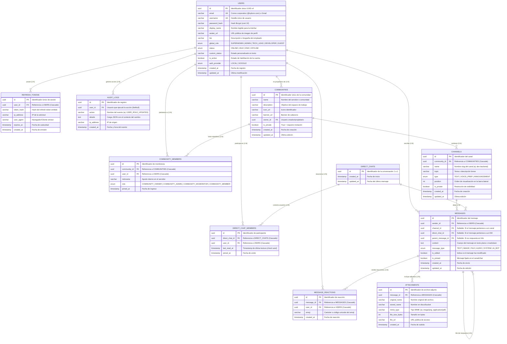

# Arquitectura de Base de Datos y Sistema SyBorx-Messenger

Este documento contiene la especificación técnica completa del diseño conceptual, lógico y físico de la base de datos relacional PostgreSQL para el sistema **SyBorx-Messenger**, así como la matriz de permisos RBAC y la integración para el equipo de frontend.

---

## 1. Diagrama Entidad-Relación (ERD Completo)

A continuación se presenta el diagrama interactivo en formato Mermaid que modela todas las entidades, relaciones, cardinalidades y tipos de datos del sistema:



---

## 2. Diccionario de Datos y Reglas de Negocio

### 2.1 Matriz de Roles Globales (RBAC)

| Rol Global | Jerarquía | Puede Crear Comunidades | Puede Gestionar Usuarios | Acceso a Auditoría | Uso Común |
| :--- | :---: | :---: | :---: | :---: | :--- |
| **SUPERADMIN** | 5 | ✅ Sí | ✅ Sí (Total) | ✅ Sí | CEO / Directores Generales |
| **ADMIN** | 4 | ✅ Sí | ✅ Sí (Roles < Admin) | ✅ Sí | Administradores de TI / SysAdmins |
| **TECH_LEAD** | 3 | ✅ Sí | ❌ No | ❌ No | Líderes Técnicos / Arquitectos |
| **DEVELOPER** | 2 | ✅ Sí | ❌ No | ❌ No | Desarrolladores Frontend / Backend |
| **GUEST** | 1 | ❌ No | ❌ No | ❌ No | Cuentas de prueba Gmail / QA externo |

---

## 3. Preparación para Funcionalidades Futuras

El esquema fue diseñado proactivamente para soportar las siguientes fases sin necesidad de migraciones destructivas:

1. **Llamadas y Videollamadas (WebRTC):**
   * El enum `ChannelType` incluye `VOICE_PREP` para canales de voz y salas WebRTC.
   * El WebSocket Gateway `/realtime` soporta señalización SDP Offer/Answer y candidatos ICE en salas dedicadas (`room:call_<id>`).
2. **Chatbots e IA Asistente:**
   * El enum `MessageType` incluye `AI_BOT` y los mensajes soportan relaciones recursivas en árbol (`parentMessageId`) para mantener hilos de contexto conversacional con modelos de lenguaje (LLMs).
3. **Almacenamiento en Cloud S3 / MinIO:**
   * La tabla `ATTACHMENTS` almacena metadatos desacoplados (`file_url`, `stored_name`, `mime_type`), permitiendo alternar entre almacenamiento local y AWS S3 / MinIO mediante variables de entorno.

---

## 4. Guía Rápida de Integración Frontend

### Autenticación:
1. `POST /api/auth/login` con `{ "identifier": "dev@syborx.com", "password": "Password123!" }`
2. Guardar `accessToken` en memoria o almacenamiento seguro del cliente.
3. Enviar cabecera `Authorization: Bearer <accessToken>` en cada petición HTTP.

### WebSockets en Tiempo Real:
```typescript
import { io } from 'socket.io-client';

const socket = io('http://localhost:3000/realtime', {
  auth: { token: accessToken },
});

// Unirse a un canal
socket.emit('channel:join', { channelId: 'uuid-del-canal' });

// Escuchar nuevos mensajes en vivo
socket.on('message:new', (message) => {
  console.log('Nuevo mensaje recibido:', message);
});

// Indicador de "Escribiendo..."
socket.emit('typing:start', { channelId: 'uuid-del-canal' });
socket.on('user:typing', ({ user, isTyping }) => {
  console.log(`${user.displayName} está escribiendo...`);
});
```

### Documentación Interactiva Swagger:
Disponible en `http://localhost:3000/api/docs`.
